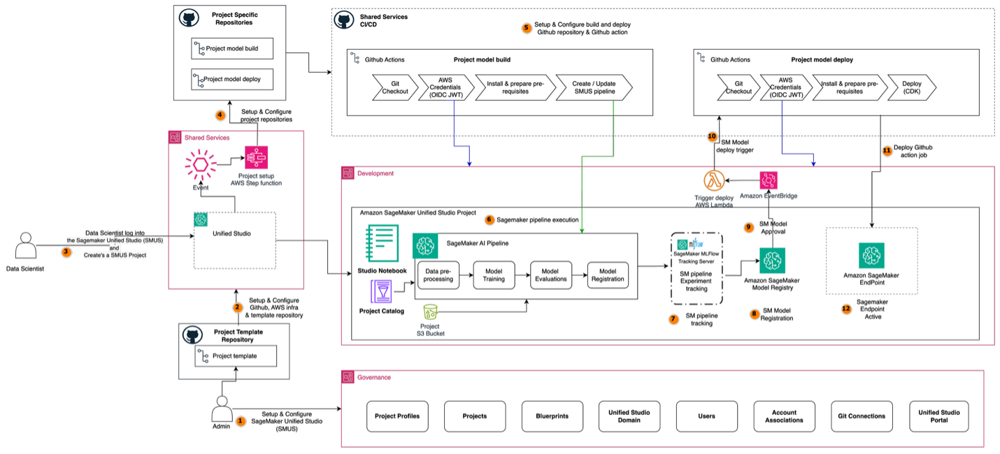

# Automate AIOps with Amazon SageMaker Unified Studio projects

An automation framework that creates GitHub repositories with AIOps templates when SageMaker Unified Studio projects are created, orchestrating the complete lifecycle from model training to automated endpoint deployment.

## Table of Contents
1. [Architecture Overview](#1-architecture-overview)
2. [Prerequisites and Setup](#2-prerequisites-and-setup)
3. [Configuration](#3-configuration)
4. [CDK Deployment](#4-cdk-deployment)
5. [Post-Deployment Configuration](#5-post-deployment-configuration)
6. [SageMaker Unified Studio Project Creation](#6-sagemaker-unified-studio-project-creation)
7. [Glue Database and Table Configuration](#7-glue-database-and-table-configuration)
8. [Build and Model Creation Process](#8-build-and-model-creation-process)
9. [Model Approval and Deployment Process](#9-model-approval-and-deployment-process)
10. [Troubleshooting](#10-troubleshooting)
11. [Clean-up](#11-clean-up)


## Repository Structure
```
├── README.md                          # This comprehensive guide
├── aiops-seed-code/                   # AI project templates and seed code
│   └── regression/                    # Regression model templates
│       ├── model_build/               # Model training and pipeline code
│       │   ├── .github/workflows/     # Build pipeline GitHub Actions
│       │   ├── ml_pipelines/          # SageMaker pipeline definitions
│       │   └── source_scripts/        # Training, preprocessing, evaluation scripts          
│       └── model_deploy/              # Model deployment and endpoint code
│           ├── .github/workflows/     # Deployment pipeline GitHub Actions
│           ├── config/dev/            # Endpoint configuration files
│           ├── deploy_endpoint/       # Deployment scripts and utilities
│           └── tests/                 # Integration and unit tests                             
└── images                             # Architecture diagrams
└── smus-cdk/                          # CDK infrastructure code
    ├── app.py                         # Main CDK application entry point
    ├── lambda/                        # Lambda function implementations
    │   ├── check-project-status/      # Project status monitoring
    │   ├── create-deploy-repository/  # Repository creation and setup
    │   └── sync-repositories/         # Repository synchronization
    ├── layers/                        # Lambda layer definitions
    │   ├── git-layer/                 # Docker file to build git executable
    │   └── python-layer/              # Python dependencies layer
    └── ml_ops_smus/                   # Core framework implementation
        └── constructs/                # CDK construct definitions
```
## 1. Architecture Overview



The SMUS framework implements an event-driven architecture that automates the complete AIOps lifecycle through a sequential workflow, seamlessly connecting SageMaker Unified Studio project creation with production-ready infrastructure.

1. The first step is configuring SageMaker Unified Studio environment, setting up domains, project profiles, and establishing the foundational infrastructure required for automated project creation and management.

2. GitHub connections are configured and necessary AWS infrastructure is deployed including EventBridge rules, Step Functions workflows, and Lambda functions that will orchestrate the automated repository setup and deployment processes.

3. Data scientists log into SageMaker Unified Studio and create a new project by selecting from available project templates defined in the project profile and configuring GitHub integration settings.

4. Project creation generates a CreateProject event that is captured by EventBridge, triggering a Step Functions workflow that automatically creates and configures both build and deploy repositories in your GitHub organization, complete with template-specific seed code and GitHub Actions workflows.

5. Code changes are pushed to the build repository or the workflow is manually triggered, causing the GitHub Actions build pipeline to automatically activate, executing environment setup, dependency installation, and pipeline validation.

6. The build workflow orchestrates the execution of the SageMaker pipeline, which processes data through preprocessing, feature engineering, model training, and evaluation with comprehensive monitoring and logging.

7. ML pipeline tracking occurs if tracking server is setup, enabling experiment tracking and model lineage management throughout the training process.

8. Model registration automatically occurs upon successful pipeline completion, registering the trained model in SageMaker Model Registry with detailed metadata, training metrics, and lineage information, initially set to "PendingManualApproval" status.

9. Data scientists or ML engineers review the model performance metrics and manually approve the model in SageMaker Model Registry, changing its status from "PendingManualApproval" to "Approved".

10. The model approval event is automatically detected by EventBridge, which invokes a deployment Lambda function that triggers the GitHub Actions deployment workflow in the deploy repository using the workflow_dispatch mechanism.

11. The deployment workflow retrieves the approved model, applies infrastructure as code definitions using AWS CDK, and provisions or updates a SageMaker endpoint with comprehensive validation, error handling, and rollback capabilities.

12. The deployed endpoint becomes active and ready to serve real-time predictions, completing the automated journey from project creation to production deployment with full traceability and governance.

## 2. Prerequisites and Setup

### AWS Account Requirements
- AWS Account with appropriate IAM permissions for CDK deployment
    - **Required AWS Permissions**: `PowerUserAccess` managed policy (or equivalent permissions for IAM, Lambda, Step Functions, EventBridge, Secrets Manager, CloudFormation, and S3)
- AWS CLI configured with credentials
- Access to AWS services: CDK, Lambda, Step Functions, EventBridge, Secrets Manager, IAM, SageMaker, DataZone, Glue, S3

### Development Environment
- **Python**: 3.9 or later
- **AWS CDK CLI**: v2.188.0 or later - Follow [AWS CDK Getting Started Guide](https://docs.aws.amazon.com/cdk/v2/guide/getting_started.html)
- **Docker Desktop**: Required for building Lambda layers - Follow [Docker Desktop installation guide](https://docs.docker.com/desktop/) and ensure Docker is running
- **Git**: For repository operations
- **Node.js**: 18.x or later (for CDK)

### GitHub Requirements
- **GitHub Organization**: You need a GitHub organization where build and deploy repositories will be created
- **Personal Access Token**: GitHub PAT with the following permissions:
  - `repo` (Full control of private repositories)
  - `workflow` (Update GitHub Action workflows)
  - `write:packages` (Upload packages to GitHub Package Registry)
You can find instructions on how to create it [here](https://docs.github.com/en/authentication/keeping-your-account-and-data-secure/managing-your-personal-access-tokens#creating-a-personal-access-token-classic).

## 3. Configuration

### Update Configuration File
Before deployment, configure the `config.py` file located in `smus-cdk/ml_ops_smus/config.py`:

```python
# smus-cdk/ml_ops_smus/config.py configuration parameters:
GitConfig(
    public_smus_aiops_org="smus-test",  # Organization with AIOPs templates 
    public_smus_aiops_org_repo="aiops-test",  # Source repository name
    public_smus_aiops_org_repo_folder="aiops-seed-code",  # Folder containing templates
    public_repo_branch="main",  # Source repository branch
    oidc_role_github_workflow="aiops-smus-github-action",  # GitHub workflow execution role
    private_github_organization="your-github-organization",  # Your GitHub organization
    private_deploy_repo_default_branch="main",  # Branch name for repositories
    github_token_secret_name="ml-ops-smus-github-token",  # Secret name in AWS Secrets Manager
)
```

### Configuration Parameters Details
- **`public_smus_aiops_org`**: GitHub organization containing the template repositories
- **`public_smus_aiops_org_repo`**: Repository name containing ML project templates
- **`public_smus_aiops_org_repo_folder`**: Folder within the template repository containing project templates
- **`oidc_role_github_workflow`**: # IAM role name that GitHub Actions can assume. The role can be created in one of the following ways:
    - **Automatic Creation**: If this role doesn't exist, it will be automatically created by cdk along with the OIDC provider for GitHub.
    - **Use Existing Role**: If you have an existing OIDC setup and role, provide the name of your existing role here so that role can be used with github actions.
    - **Manual Creation**: If you want to manually create the OIDC setup without using CDK:
        - Follow [AWS Documentation](https://docs.aws.amazon.com/IAM/latest/UserGuide/id_roles_create_for-idp_oidc.html) to create OIDC provider and required permissions
        - Create a role with the following trust relationship:

        ```python
        {
            "Version": "2012-10-17",
            "Statement": [
                {
                    "Effect": "Allow",
                    "Principal": {
                        "Federated": "arn:aws:iam::<account-id>:oidc-provider/token.actions.githubusercontent.com"
                    },
                    "Action": "sts:AssumeRoleWithWebIdentity",
                    "Condition": {
                        "StringLike": {
                            "token.actions.githubusercontent.com:sub": "repo:your-github-organization/*"
                        }
                    }
                }
            ]
        }
        ```

        - Attach the following policy to the role:

        ```python
        {
            "Version": "2012-10-17",
            "Statement": [
                {
                    "Effect": "Allow",
                    "Action": [
                        "sagemaker:CreatePipeline",
                        "sagemaker:UpdatePipeline",
                        "sagemaker:StartPipelineExecution",
                        "sagemaker:DescribePipeline",
                        "sagemaker:DescribePipelineExecution",
                        "sagemaker:ListPipelineExecutions",
                        "sagemaker:AddTags",
                        "sagemaker:ListTags",
                        "sagemaker:ListProcessingJobs",
                        "sagemaker:DescribeProcessingJob",
                        "sagemaker:DescribeImageVersion",
                        "sagemaker:CreateProcessingJob",
                        "sagemaker:ListPipelineExecutionSteps",
                        "sagemaker:ListModelPackages",
                        "sagemaker:StopProcessingJob",
                        "sagemaker:CreateModel",
                        "sagemaker:CreateEndpointConfig",
                        "sagemaker:CreateEndpoint",
                        "sagemaker:DeleteModel",
                        "sagemaker:DeleteEndpointConfig",
                        "sagemaker:DeleteEndpoint",
                        "sagemaker:DescribeModel",
                        "sagemaker:DescribeEndpointConfig",
                        "sagemaker:DescribeEndpoint",
                        "sagemaker:InvokeEndpoint"
                    ],
                    "Resource": "*"
                },
                {
                    "Effect": "Allow",
                    "Action": [
                        "cloudformation:ListStacks",
                        "cloudformation:DescribeStacks",
                        "cloudformation:CreateStack",
                        "cloudformation:UpdateStack",
                        "cloudformation:DeleteStack",
                        "cloudformation:ListStackResources",
                        "cloudformation:DescribeStackEvents",
                        "cloudformation:GetTemplateSummary",
                        "cloudformation:ValidateTemplate",
                        "cloudformation:GetTemplate",
                        "cloudformation:CreateChangeSet",
                        "cloudformation:DeleteChangeSet",
                        "cloudformation:ListChangeSets",
                        "cloudformation:DescribeChangeSet",
                        "cloudformation:ExecuteChangeSet",
                        "cloudformation:SetStackPolicy",
                        "cloudformation:DescribeStackResource"
                    ],
                    "Resource": "*"
                },
                {
                    "Effect": "Allow",
                    "Action": [
                        "ecr:CreateRepository",
                        "ecr:DeleteRepository",
                        "ecr:DescribeRepositories",
                        "ecr:PutLifecyclePolicy",
                        "ecr:SetRepositoryPolicy"
                    ],
                    "Resource": "*"
                },
                {
                    "Effect": "Allow",
                    "Action": "ssm:*",
                    "Resource": "arn:aws:ssm:*:*:parameter/cdk-bootstrap/*"
                },
                {
                    "Effect": "Allow",
                    "Action": [
                        "iam:CreateRole",
                        "iam:Get*",
                        "iam:Delete*",
                        "iam:List*",
                        "iam:Put*",
                        "iam:Tag*",
                        "iam:Attach*",
                        "iam:Detach*",
                        "iam:Update*"
                    ],
                    "Resource": "*"
                },
                {
                    "Effect": "Allow",
                    "Action": [
                        "s3:Put*",
                        "s3:Get*",
                        "s3:List*",
                        "s3:Create*",
                        "s3:Delete*"
                    ],
                    "Resource": "*"
                },
                {
                    "Effect": "Allow",
                    "Action": "sts:AssumeRole",
                    "Resource": [
                        "arn:aws:iam::*:role/cdk-*",
                        "arn:aws:iam::*:role/cdk-gitactions-*"
                    ]
                },
                {
                    "Effect": "Allow",
                    "Action": [
                        "glue:GetTable",
                        "glue:GetDatabase",
                        "glue:GetPartitions"
                    ],
                    "Resource": "*"
                },
                {
                    "Effect": "Allow",
                    "Action": "iam:PassRole",
                    "Resource": "*",
                    "Condition": {
                        "StringEquals": {
                            "iam:PassedToService": "sagemaker.amazonaws.com"
                        }
                    }
                },
                {
                    "Effect": "Allow",
                    "Action": [
                        "logs:CreateLogGroup",
                        "logs:CreateLogStream",
                        "logs:PutLogEvents"
                    ],
                    "Resource": "*"
                }
            ]
        }
        ```

        - Provide the name of this manually created role in the configuration
- **`private_github_organization`**: Your GitHub organization where build/deploy repos will be created
- **`github_token_secret_name`**: Name of the secret in AWS Secrets Manager for GitHub token

## 4. CDK Deployment

### Environment Setup
1. **Clone the repository**:
```bash
git clone https://github.com/aws-samples/sample-smus-aiops.git
cd sample-smus-aiops/smus-cdk
```

2. **Create and activate virtual environment**:
```bash
python -m venv .venv
source .venv/bin/activate  # Linux/MacOS
# or
.venv\Scripts\activate  # Windows
```

3. **Install dependencies**:
```bash
pip install -r requirements.txt
```

### CDK Bootstrap and Deployment
1. **Verify Docker is running**:
```bash
docker info
```

2. **Bootstrap CDK** (if not already done):
```bash
cdk bootstrap
```

3. **Synthesize the stack** (optional verification):
```bash
cdk synth
```

4. **Deploy the stack**:
```bash
cdk deploy --require-approval never
```

### Verify Deployment
After successful deployment, verify the following resources are created:
- **Lambda Functions**:
  - `ai-ops-check-project-status`
  - `ai-ops-sync-repositories`
  - `ai-ops-create-deploy-repo`
  - `MlOpsSmusStack-model-approval-trigger`
- **Step Functions**: `ml-ops-project-setup`
- **EventBridge Rules**: 
  - `ml-ops-smus-datazone-project-rule-v2`
  - `MlOpsSmusStack-model-approval-rule`
- **IAM Role**: `aiops-smus-github-action`
- **Secrets Manager**: `ml-ops-smus-github-token`
- **Identity Provider**: `token.actions.githubusercontent.com`

## 5. Post-Deployment Configuration

### Update GitHub Token Secret
1. **Navigate to AWS Secrets Manager Console**
2. **Find the secret**: `ml-ops-smus-github-token`
3. **Click "Retrieve secret value" → "Edit"**
4. **Update the `token` field** with your GitHub Personal Access Token
5. **Save the changes**

### Verify IAM Role Trust Relationship
Check that the GitHub workflow role has the correct trust relationship:
```bash
aws iam get-role --role-name aiops-smus-github-action --query 'Role.AssumeRolePolicyDocument'
```

The trust relationship should include:
```json
{
  "StringLike": {
    "token.actions.githubusercontent.com:sub": "repo:your-github-organization/*"
  }
}
```

### Verify EventBridge Rules
Confirm EventBridge rules are active:
```bash
aws events describe-rule --name "ml-ops-smus-datazone-project-rule-v2"
aws events describe-rule --name "MlOpsSmusStack-model-approval-rule"
```

### Git Connection Setup

### Create SageMaker Unified Studio Domain (if needed)
1. **Navigate to SageMaker Unified Studio Console**
2. **Create a new domain** or use existing domain following [Create a Amazon SageMaker Unified Studio domain - quick setup](https://docs.aws.amazon.com/sagemaker-unified-studio/latest/adminguide/domain-quick-setup.html)
3. **Note the domain ID** (format: `dzd_xxxxxxxxxx`)

### Configure Git Connection in SageMaker Unified Studio
Before creating projects, you need to set up a Git connection to enable integration between SMUS and your GitHub repository.

1. **Navigate to your SageMaker Unified Studio domain**
2. **Go to domain details page → Connections tab**
3. **Click "Create Git connection" → Select "GitHub"**
4. **Configure connection**:
   - **Connection name**: `aws-github-smus-connection`
   - **Click "Connect to GitHub"**
   - **You'll be redirected to Authorization page**
   - **Click "Authorize AWS connector for GitHub"**
   - **Select "Install a new app"**
5. **Install AWS connector for GitHub**:
   - **Select your target organization** (same as `private_github_organization` in config)
   - **Repository access**: Select "All repositories"
   - **Click "Install & Authorize" → "Connect"**
6. **Enable connection**:
   - **Select your newly created connection**
   - **Click "Enable" to complete setup**

## Create Custom Project Profile

You need to create a custom project profile that will be used for your ML projects.

1. **Navigate to domain details page**
2. **Find "Project profiles" tile → Click "Create"**
3. **Configure profile**:
   - **Name**: `regression`
   - **Creation option**: "Create from a template"
   - **Capabilities**: "All capabilities"
4. **Default tooling blueprint deployment settings**:
   - **Keep default Account and region settings**
   - **Git connection**: Select `aws-github-smus-connection`
   - **Enable**: "Users can edit Git connection"
   - **Authorization**: "Users and groups"
5. **Authorization settings**:
   - **Choose**: "Selected users and groups"
   - **Select SSO users and groups** who can access this project profile
6. **Project profile readiness**: Check "Enable project profile on creation"

## 6. SageMaker Unified Studio Project Creation

### Create SageMaker Project
1. **Navigate to your SMUS domain** by clicking "Open unified studio"
2. **Sign in with SSO** using the username and password for the user granted access to the project profile
3. **In the SMUS home page, click "Create project"**
4. **Configure project**:
   - **Project name**: Enter your project name (e.g., `smus-blog-test`)
   - **Project profile**: Select `regression`
   - **Click "Continue"**
5. **Customize blueprint parameters**:
   - **Under Tooling**: Select `aws-github-smus-connection` as the connection name
   - **Connection provider**: Select "New repository and new branch"
   - **Repository name**: Enter build repo name (e.g., `smus-blog-build-repo`)
   - **Click "Continue"**
6. **Review and create**:
   - **Review your selections**
   - **Click "Create project"**
   - **Wait 5-10 minutes for project creation to complete**

### Repository Naming Convention
After project creation, you'll see two repositories created in your private GitHub organization:
- **Build repository**: `{your-specified-name}` (e.g., `smus-blog-build-repo`)
- **Deploy repository**: `{project-id}-{datazone-domain-id}-deploy-repo`

### Workflow Trigger Behavior
- **Build Repository**: Workflow triggers on code changes but requires `TRIGGER_PIPELINE_EXECUTION=true` to execute
- **Deploy Repository**: Workflow only triggers via model approval events or manual execution (no automatic triggers on code changes)

## 7. Glue Database and Table Configuration

#### Create Table in SageMaker Unified Studio
After project creation, you need to create a Glue table with your data:

1. **Login to your project in SageMaker Unified Studio**
2. **Navigate to Data → Lakehouse → awsdatacatalog**
3. **Find your Glue database**: `glue_db_****`
4. **Click the table tile option on the side**
5. **Upload dataset**:
   - **Download abalone dataset** from your build repository: `ml_pipelines/data/abalone-dataset.csv`
   - **Table name**: `abalone`
   - **Click "Next"**
6. **In the add data page**:
   - **Review the schema**
   - **Click "Create table"**

**Note**: During table creation, make note of the Glue database and table names as you'll need them in the next step.

#### Update GitHub Secrets
Update the GitHub secrets in both build and deploy repositories with these Glue database and table names:

**For Build Repository**
1. **Navigate to**: `your-org/project-build-repo`
2. **Go to Settings → Secrets and variables → Actions**
3. **Update the following secrets**:
   - `GLUE_DATABASE`: Update from `glue_db` to your actual database name (e.g., `glue_db_3hwskube5dybhj`)
   - `GLUE_TABLE`: Update from `abalone` to your actual table name (e.g., `abalone`)

**For Deploy Repository**
1. **Navigate to**: `your-org/project-deploy-repo`
2. **Go to Settings → Secrets and variables → Actions**
3. **Update the same secrets**:
   - `GLUE_DATABASE`: Your actual database name
   - `GLUE_TABLE`: Your actual table name

#### Enable Pipeline Execution
After updating the Glue database and table secrets, you need to enable pipeline execution:

**For Build Repository**
1. **Navigate to**: `your-org/project-build-repo`
2. **Go to Settings → Secrets and variables → Actions → Variables tab**
3. **Create a new repository variable**:
   - **Name**: `TRIGGER_PIPELINE_EXECUTION`
   - **Value**: `true`
4. **Click "Add variable"**

**Note**: By default, pipeline execution is disabled to prevent failures when Glue configuration is not yet updated. This variable must be set to `true` to enable the SageMaker pipeline execution.

## 8. Build and Model Creation Process

After updating the GitHub secrets and enabling pipeline execution, the build workflow can be triggered. The workflow includes a safety check that prevents execution until the `TRIGGER_PIPELINE_EXECUTION` variable is set to `true`, ensuring that Glue database and table configurations are properly updated before running the pipeline.

#### Manual Workflow Trigger 
Follow these steps to manually trigger the workflow:
1. **Ensure Prerequisites**:
   - Glue database and table secrets are updated (Section 6)
   - `TRIGGER_PIPELINE_EXECUTION` variable is set to `true`
2. **Go to build repository GitHub Actions**
3. **Select the workflow**
4. **Click "SageMaker Pipeline build SMUS project"**
5. **Click "Run workflow"**

**Note**: If the `TRIGGER_PIPELINE_EXECUTION` variable is not set to `true`, the workflow will exit gracefully with instructions on how to enable it.

#### Verify Model Registration
After successful build pipeline execution:
1. **Navigate to SageMaker Unified Studio**
2. **Go to Build → AI OPS → Model Registry**
3. **Find your model package group**: `aiops-{project-id}-models`
4. **Verify model version 1** with status "PendingManualApproval"

## 9. Model Approval and Deployment Process

#### Manual Model Approval
1. **Navigate to SageMaker Unified Studio**
2. **Go to Build → AI OPS → Model Registry**
3. **Find your model package group**: `aiops-{project-id}-models`
4. **Select the model package** you want to approve
5. **Click "Update model approval status"**
6. **Change status from "PendingManualApproval" to "Approved"**
7. **Add approval comments** (optional)
8. **Click "Update status"**

#### Automated Deployment Trigger
When a model is approved:
1. **SageMaker emits approval event** to EventBridge
2. **EventBridge rule** `MlOpsSmusStack-model-approval-rule` detects the event
3. **Model approval Lambda** `MlOpsSmusStack-model-approval-trigger` is invoked to:
   - **Extract project information** from the event
   - **Construct deploy repository name**: `project-deploy-repo`
   - **Trigger GitHub Actions workflow** in deploy repository via API
   - **Use workflow_dispatch** trigger with appropriate inputs

#### Deploy Workflow Execution
Once the automated deployment Lambda successfully triggers the workflow, the following deployment steps are executed in the deploy repository:

1. **Environment Setup**:
   - Checkout repository code
   - Set up Python environment
   - Configure AWS credentials
   - Install dependencies

2. **Model Discovery**:
   - Find the latest approved model in Model Registry
   - Extract model package ARN and details
   - Validate model approval status

3. **Model Deployment**:
   - Create SageMaker model from approved model package
   - Create or update endpoint configuration
   - Deploy or update SageMaker endpoint
   - Wait for endpoint to be "InService"

4. **Endpoint Validation**:
   - Test endpoint with sample data
   - Validate response format
   - Check endpoint health

5. **Status Reporting**:
   - Report deployment success/failure
   - Provide endpoint details and access information

#### Monitor Deployment
1. **Check GitHub Actions** in deploy repository
2. **Monitor workflow execution** status and logs
3. **Monitor SageMaker endpoints**:
```bash
# List endpoints
aws sagemaker list-endpoints --sort-by "CreationTime" --sort-order "Descending"

# Check endpoint status
aws sagemaker describe-endpoint --endpoint-name "your-endpoint-name"
```

#### Verify Deployed Endpoint
1. **Navigate to SageMaker Unified Studio**
2. **Go to Model Development → Inference → Endpoints**
3. **Verify endpoint status**: "InService"
4. **Test endpoint** with sample data if needed

### 10. Troubleshooting

#### Common Issues and Solutions

**1. GitHub Token Issues**
- Problem: Repository creation fails with authentication errors
- Solution: Verify GitHub token in Secrets Manager, ensure correct permissions

**2. IAM Role Trust Relationship**
- Problem: GitHub Actions cannot assume IAM role
- Solution: Verify trust relationship includes correct GitHub organization

**3. EventBridge Not Triggering**
- Problem: Step Functions not triggered on project creation
- Solution: Check EventBridge rule is enabled and pattern matches

**4. Model Approval Not Triggering Deploy**
- Problem: Deploy workflow not triggered after model approval
- Solution: Verify model approval EventBridge rule and Lambda logs

**5. Glue Database/Table Not Found**
- Problem: Build pipeline fails with Glue database errors
- Solution: Update GitHub secrets with correct Glue database/table names

#### Log Locations
- **Lambda Functions**: `/aws/lambda/{function-name}`
- **Step Functions**: `/aws/stepfunctions/{state-machine-name}`
- **EventBridge**: `/aws/events/rule/{rule-name}`
- **GitHub Actions**: Repository → Actions tab

## 11. Clean-up

### Endpoint Cleanup
When you no longer need the deployed endpoints, clean them up to avoid ongoing costs:

```bash
# Delete endpoint (stops inference)
aws sagemaker delete-endpoint --endpoint-name <endpoint-name>

# Delete endpoint configuration
aws sagemaker delete-endpoint-config --endpoint-config-name <config-name>

# Delete model
aws sagemaker delete-model --model-name <model-name>
```

### Pipeline Cleanup
```bash
# Delete SageMaker pipeline
aws sagemaker delete-pipeline --pipeline-name "githubactions-<project-id>"

# Clean up S3 artifacts (be careful - this removes all data)
aws s3 rm s3://<artifact-bucket>/githubactions-<project-id>/ --recursive
```

### Model Registry Cleanup
```bash
# Delete model package group (removes all model versions)
aws sagemaker delete-model-package-group --model-package-group-name <group-name>
```

### Infrastructure Cleanup
```bash
# Destroy CDK stack (removes all SMUS infrastructure)
cd smus-cdk
cdk destroy

# Clean up CDK bootstrap (optional - only if not used by other projects)
# aws cloudformation delete-stack --stack-name CDKToolkit
```

### SageMaker Unified Studio Cleanup
1. **Delete project** in SageMaker Unified Studio
2. **Remove project profile** if no longer needed
3. **Disable Git connection** if not used by other projects
