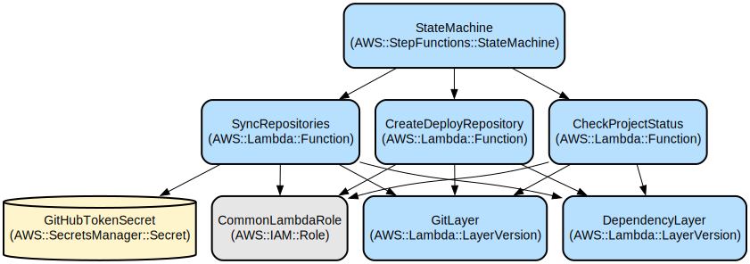

# AWS MLOps Repository Synchronization Framework

A robust AWS CDK-based solution that automates the synchronization of ML model build and deployment repositories while managing GitHub secrets and repository configurations for MLOps workflows.

This project provides an automated infrastructure for managing machine learning operations (MLOps) workflows by synchronizing repositories, handling GitHub secrets, and orchestrating the deployment process through AWS Step Functions. It leverages AWS CDK for infrastructure as code and includes Lambda functions for repository management and status monitoring.

The framework integrates with AWS DataZone and SageMaker, providing a seamless experience for ML project deployment while maintaining security best practices through AWS Secrets Manager and IAM role management. It also supports Glue database and table integration for data processing workflows.

## Repository Structure
```
smus-cdk/
├── app.py                  # Main CDK application entry point
├── cdk.json               # CDK configuration file
├── lambda/                # Lambda function implementations
│   ├── check-project-status/    # Project status monitoring
│   ├── create-deploy-repository/ # Repository creation and setup
│   └── sync-repositories/       # Repository synchronization
├── layers/                # Lambda layer definitions
│   ├── git-layer/        # Git binary layer for Lambda
│   └── python-layer/     # Python dependencies layer
├── ml_ops_smus/          # Core framework implementation
│   └── constructs/       # CDK construct definitions
└── requirements.txt      # Project dependencies
```

## Usage Instructions
### Prerequisites
- Python 3.9 or later
- AWS CDK CLI (v2.188.0 or later)
- Docker (for building Lambda layers)
- AWS CLI configured with appropriate credentials

### Configuration Setup
Before proceeding with the installation, you need to configure the `config.py` file located in the `smus-cdk/ml_ops_smus` directory. This file contains essential parameters for the repository synchronization:

```python
# smus-cdk/ml_ops_smus/config.py configuration parameters:
GitConfig(
    public_aiops_templates_org="aws-samples",  #Organization with AIOPs templates 
    public_repo_branch="main",  # Source repository branch
    oidc_role_github_workflow="aiops-smus-github-action",  # SageMaker pipeline execution role
    private_github_organization ="your-github-organization"  # This should match the GitHub organization configured in your AWS CodeStar Connections and we will be creating our build and deploy repo under this git organization.
    private_deploy_repo_default_branch="main",  # Branch name for private repository
    specific_folders=[],  # Optional: List of specific folders to sync
    github_token_secret_name="ml-ops-smus-github-token",  # Name of secret in AWS Secrets Manager
)
```

Update these parameters according to your environment:
- `public_aiops_templates_org`: Organization with AIOPs templates 
- `oidc_role_github_workflow`: IAM role which can be assumed by github workflow
- `private_deploy_repo_default_branch`: Branch name for the private repository (default: "main")
- `github_token_secret_name`: Name of the secret in AWS Secrets Manager that stores your GitHub token
- `private_github_organization`: GitHub organization name where build and deploy repositories will be created 

Note: The GitHub token secret (ml-ops-smus-github-token) is automatically created by the CDK deployment. After deployment, you need to update the secret value in AWS Secrets Manager with your GitHub Personal Access Token. This token is required to:
- Clone and push to private repositories
- Create new repositories
- Manage repository secrets
- Synchronize repository contents

### Glue Integration
The framework automatically creates GitHub secrets for Glue database and table access:
- `GLUE_DATABASE`: Default value is "glue_db"
- `GLUE_TABLE`: Default value is "abalone"

**Note**: You need to update these values once you create a table under Glue Database in SageMaker Unified Studio.

### Installation
1. Clone the repository:
```bash
git clone <repository-url>
cd smus-cdk
```

2. Create and activate a virtual environment:
```bash
python -m venv .venv
source .venv/bin/activate  # Linux/MacOS
```

3. Install dependencies:
```bash
pip install -r requirements.txt
```

4. Bootstrap CDK (if not already done):
```bash
cdk bootstrap
```

5. Deploy the stack:
```bash
cdk deploy
```

6. After deployment, update the GitHub token secret in AWS Secrets Manager with your Personal Access Token.

7. Update the IAM role with the trust relationship.??

## Data Flow
The framework orchestrates data flow between repositories and AWS services through a series of coordinated Lambda functions and Step Functions.

```ascii
[GitHub Source Repo] --> [Sync Lambda] --> [Private Build Repo]
                                              |
[GitHub Template] --> [Create Deploy Lambda] --> [Deploy Repo]
                            |
                    [Secrets Manager] --> [GitHub Secrets]
```

Key component interactions:
1. Source repository is monitored for changes in model build folders
2. Lambda functions handle repository synchronization and creation
3. Step Functions orchestrate the overall workflow
4. Secrets Manager securely stores and provides GitHub credentials
5. IAM roles control access to AWS services
6. CloudWatch monitors execution and provides logging
7. GitHub API manages repository operations and secret configuration
8. Glue database and table information is stored as GitHub secrets for ML workflows

## Infrastructure


### Lambda Functions
- `ml-ops-check-project-status`: Monitors SageMaker Unified Studio project deployment status
- `ml-ops-sync-repositories`: Handles repository synchronization and creates GitHub secrets including Glue database and table information. This Lambda:
  - Locates the SageMaker domain associated with the project using DataZone project tags
  - Dynamically retrieves the project's S3 location from the domain's `ProjectS3Path` tag
  - Clones the source repository and copies the `model_build` folder contents to the build repository
  - Copies `.github/workflows` from the `model_build` folder to maintain CI/CD configurations
  - Creates GitHub secrets with SageMaker, DataZone, and Glue configuration
  - Updates IAM permissions for the SageMaker execution role to access the project's S3 bucket
- `ml-ops-create-deploy-repo`: Creates and configures deployment repositories with necessary GitHub secrets. This Lambda:
  - Creates a new GitHub repository in the configured organization/username
  - Retrieves the project's S3 location from SageMaker domain tags
  - Finds a template repository matching the project profile name
  - Copies the `model_deploy` folder contents to the deploy repository
  - Creates GitHub secrets with the same configuration as the build repository

### Layers
- `ml-ops-smus-git-layer`: Provides Git binary support for Lambda functions
- Python dependencies layer: Contains required Python packages

### IAM Roles
- Lambda execution role with permissions for:
  - CloudWatch Logs
  - Secrets Manager
  - DataZone
  - SageMaker
  - CodeStar Connections

### Step Functions
- State machine orchestrating the repository setup and synchronization workflow
- Includes error handling and retry logic

## Deployment
1. Prerequisites:
   - AWS account with appropriate permissions
   - GitHub organization access
   - Docker installed locally

2. Deploy Infrastructure:
```bash
# Build layers
cdk synth

# Deploy stack
cdk deploy
```

3. Verify Deployment:
- Check AWS Console for created resources
- Verify Lambda functions are deployed
- Confirm Step Functions state machine creation

## Advanced Configuration

### S3 Location Configuration
The framework dynamically determines the S3 location for artifacts using the following process:

1. It searches for a SageMaker domain with a tag matching the DataZone project ID
2. It looks for a `ProjectS3Path` tag on the domain, which contains the S3 path
3. If the tag is not found, it constructs a default path using the account ID, region, domain ID, and project ID
4. This S3 path is used for:
   - Setting the `ARTIFACT_BUCKET` GitHub secret
   - Configuring IAM permissions for the SageMaker execution role

This approach eliminates the need for hardcoded S3 bucket names and ensures each project uses its own dedicated S3 location.

### GitHub Workflows
The framework automatically copies GitHub workflow files (`.github/workflows`) from both the `model_build` and `model_deploy` folders to their respective repositories. This ensures that CI/CD pipelines are properly configured in both repositories.
