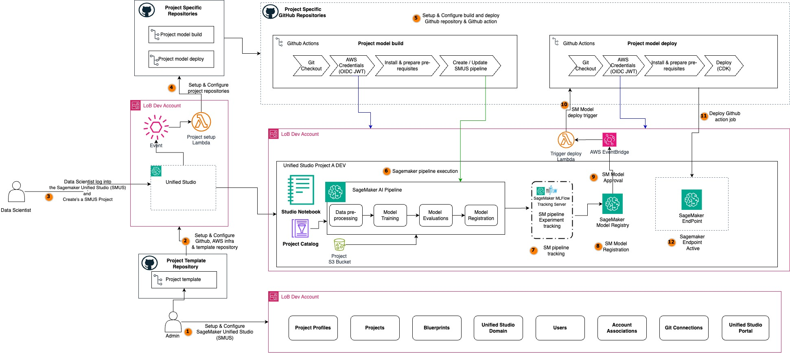

# MLOps SageMaker Unified Studio Model Deployment with GitHub Actions

This repository contains resources required to deploy approved ML models from SageMaker Model Registry to SageMaker endpoints using GitHub Actions for CI/CD.

**Note**: Please refer to the model build section and complete the model training process before proceeding with deployment.

## Table of Contents
1. [Solution Architecture](#solution-architecture)
2. [Repository Structure](#repository-structure)
3. [Deployment Overview](#deployment-overview)
4. [GitHub Connection and Setup](#github-connection-and-setup)
5. [GitHub Secrets Configuration](#github-secrets-configuration)
6. [Workflow Trigger Mechanism](#workflow-trigger-mechanism)
7. [Model Approval Process](#model-approval-process)
8. [Deployment Workflow](#deployment-workflow)
9. [Endpoint Management](#endpoint-management)
10. [Local Deployment and Testing](#local-deployment-and-testing)
11. [Monitoring and Validation](#monitoring-and-validation)
12. [Troubleshooting](#troubleshooting)
13. [Clean-up](#clean-up)

## Solution Architecture

The model deployment process follows an event-driven architecture:
1. **Model Approval** → EventBridge → Lambda → GitHub Actions → SageMaker Endpoint




## Repository Structure

```
.
├── LICENSE.txt
├── README.md
├── .github
│   └── workflows
│       └── deploy_model_pipeline.yml  <--- GitHub Actions deployment workflow
├── config
│   └── dev
│       └── endpoint-config.yml        <--- Endpoint configuration
├── deploy_endpoint
│   ├── deploy.py                      <--- Deployment script
│   ├── requirements.txt               <--- Python dependencies
│   └── utils.py                       <--- Utility functions
├── tests
│   └── integration_tests
│       └── buildspec.yml              <--- Test specifications
└── requirements.txt                   <--- Project dependencies
```

## Deployment Overview

### Key Features:
- **Event-driven deployment**: Automatically triggered when models are approved in SageMaker Model Registry
- **Manual deployment support**: Can be manually triggered via GitHub Actions
- **Endpoint management**: Creates new endpoints or updates existing ones
- **Configuration-driven**: Uses YAML configuration for endpoint settings
- **Testing integration**: Includes endpoint validation and testing

### Deployment Flow:
1. Model approved in SageMaker Model Registry
2. EventBridge detects approval event
3. Lambda function triggers GitHub Actions workflow
4. Workflow deploys model to SageMaker endpoint
5. Endpoint validation and testing

## GitHub Connection and Setup

### Prerequisites:
1. **Completed model build setup**: Ensure the build repository is configured and has produced approved models
2. **IAM OIDC Provider**: Same OIDC provider used for model build repository
3. **IAM Role**: Same IAM role with deployment permissions

### Required IAM Permissions:
The GitHub Actions role needs the following additional permissions for deployment:

```json
{
    "Version": "2012-10-17",
    "Statement": [
        {
            "Effect": "Allow",
            "Action": [
                "sagemaker:CreateModel",
                "sagemaker:CreateEndpointConfig",
                "sagemaker:CreateEndpoint",
                "sagemaker:UpdateEndpoint",
                "sagemaker:DescribeEndpoint",
                "sagemaker:DescribeEndpointConfig",
                "sagemaker:DescribeModel",
                "sagemaker:ListEndpoints",
                "sagemaker:InvokeEndpoint",
                "sagemaker:DescribeModelPackage",
                "sagemaker:ListModelPackages"
            ],
            "Resource": "*"
        },
        {
            "Effect": "Allow",
            "Action": [
                "iam:PassRole"
            ],
            "Resource": "arn:aws:iam::*:role/*SageMaker*",
            "Condition": {
                "StringEquals": {
                    "iam:PassedToService": "sagemaker.amazonaws.com"
                }
            }
        }
    ]
}
```

## GitHub Secrets Configuration

Create the following GitHub secrets for the deployment repository. Most secrets are the same as the build repository:

### Required Secrets:

- `OIDC_ROLE_GITHUB_WORKFLOW`: The ARN of the IAM role that GitHub Actions will assume
- `SAGEMAKER_PIPELINE_ROLE_ARN`: The ARN of the IAM role used for SageMaker operations
- `SAGEMAKER_PROJECT_NAME`: The name of the SageMaker project
- `SAGEMAKER_PROJECT_ID`: The unique identifier for the SageMaker project
- `AMAZON_DATAZONE_DOMAIN`: The domain name for Amazon DataZone integration
- `AMAZON_DATAZONE_SCOPENAME`: The scope name within Amazon DataZone
- `SAGEMAKER_DOMAIN_ARN`: The ARN of the SageMaker Studio domain
- `SAGEMAKER_SPACE_ARN`: The ARN of the SageMaker Studio space
- `AMAZON_DATAZONE_PROJECT`: The Amazon DataZone project name
- `REGION`: The AWS region where resources are deployed
- `ARTIFACT_BUCKET`: The S3 bucket used to store artifacts
- `MODEL_PACKAGE_GROUP_NAME`: The name of the model package group in Model Registry
- `GLUE_DATABASE`: The name of the Glue database (for consistency)
- `GLUE_TABLE`: The name of the Glue table (for consistency)

### Deployment-Specific Configuration:

The endpoint configuration is managed through the `config/dev/endpoint-config.yml` file:

```yaml
# Example endpoint configuration
endpoint_name: "smus-abalone-endpoint"
instance_type: "ml.t2.medium"
instance_count: 1
variant_name: "AllTraffic"
initial_weight: 1
```

## Workflow Trigger Mechanism

### Important: No Automatic Code Triggers
Unlike the build repository, the deployment workflow **does not trigger automatically** on code changes (push/pull_request). This is intentional to prevent unintended deployments.

### Supported Triggers:

1. **Model Approval Events** (Primary):
   - Triggered automatically when a model is approved in SageMaker Model Registry
   - Uses EventBridge → Lambda → GitHub Actions workflow_dispatch

2. **Manual Execution**:
   - Go to repository Actions tab
   - Select "Sagemaker Model Deploy Pipeline SMUS project"
   - Click "Run workflow"
   - Choose log level (info/warning/debug)

### Workflow Structure:
```yaml
on:
  workflow_dispatch:
    inputs:
      logLevel:
        description: 'Log level'
        required: true
        default: 'warning'
        type: choice
        options:
          - info
          - warning
          - debug
```

## Model Approval Process

### Approving Models:
1. **Navigate to SageMaker Unified Studio**
2. **Go to Build → AI OPS → Model Registry**
3. **Find your model package group**: `aiops-{project-id}-models`
4. **Select the model package** to approve
5. **Click "Update model approval status"**
6. **Change status** from "PendingManualApproval" to "Approved"
7. **Add approval comments** (optional)
8. **Click "Update status"**

### Automatic Deployment Trigger:
When a model is approved:
1. **SageMaker emits approval event** to EventBridge
2. **EventBridge rule** detects the event
3. **Lambda function** extracts project information and triggers deployment workflow
4. **GitHub Actions workflow** executes deployment

## Deployment Workflow

### Workflow Steps:

1. **Environment Setup**:
   - Checkout repository code
   - Set up Python environment
   - Configure AWS credentials
   - Install dependencies

2. **Model Discovery**:
   - Find the latest approved model in Model Registry
   - Extract model package ARN and details
   - Validate model approval status

3. **Model Deployment**:
   - Create SageMaker model from approved model package
   - Create or update endpoint configuration
   - Deploy or update SageMaker endpoint
   - Wait for endpoint to be "InService"

4. **Endpoint Validation**:
   - Test endpoint with sample data
   - Validate response format
   - Check endpoint health

5. **Status Reporting**:
   - Report deployment success/failure
   - Provide endpoint details and access information

### Sample Workflow Execution:
```
=== Model Deployment Started ===
Finding approved model in registry...
Found approved model: arn:aws:sagemaker:...
Creating SageMaker model...
Creating endpoint configuration...
Deploying endpoint: smus-abalone-endpoint
Waiting for endpoint to be InService...
Endpoint Status: Creating
Endpoint Status: InService
Testing endpoint with sample data...
Deployment completed successfully!
```

## Endpoint Management

### Endpoint Lifecycle:

1. **New Deployment**:
   - Creates new SageMaker model
   - Creates new endpoint configuration
   - Creates new endpoint

2. **Model Updates**:
   - Creates new model version
   - Updates existing endpoint with new model
   - Performs blue/green deployment

3. **Configuration Changes**:
   - Modify `config/dev/endpoint-config.yml`
   - Commit changes (note: won't auto-trigger deployment)
   - Manually trigger deployment workflow

### Endpoint Monitoring:
```bash
# List endpoints
aws sagemaker list-endpoints --region <region>

# Check endpoint status
aws sagemaker describe-endpoint --endpoint-name <endpoint-name> --region <region>

# Test endpoint
aws sagemaker-runtime invoke-endpoint \
  --endpoint-name <endpoint-name> \
  --content-type application/json \
  --body '{"instances": [[0.5, 0.3, 0.2, 0.1, 0.4, 0.6, 0.7, 0.8]]}' \
  response.json
```

## Local Deployment and Testing

### Prerequisites:
- Python 3.10 or [Miniconda](https://docs.conda.io/en/latest/miniconda.html)
- [AWS CLI](https://aws.amazon.com/cli/) configured with appropriate credentials
- Access to SageMaker Model Registry with approved models

### Local Setup:

1. **Clone and setup environment**:
   ```bash
   cd model_deploy
   python3 -m venv .venv
   source .venv/bin/activate
   pip install -r requirements.txt
   ```

2. **Configure deployment**:
   - Update `config/dev/endpoint-config.yml` with your settings
   - Ensure AWS credentials are configured

3. **Run deployment locally**:
   ```bash
   python deploy_endpoint/deploy.py \
     --model-package-group-name <MODEL_PACKAGE_GROUP_NAME> \
     --endpoint-name <ENDPOINT_NAME> \
     --region <REGION>
   ```

### Local Testing:
```bash
# Test the deployed endpoint
python -c "
import boto3
import json

client = boto3.client('sagemaker-runtime', region_name='<region>')
response = client.invoke_endpoint(
    EndpointName='<endpoint-name>',
    ContentType='application/json',
    Body=json.dumps({'instances': [[0.5, 0.3, 0.2, 0.1, 0.4, 0.6, 0.7, 0.8]]})
)
print(response['Body'].read().decode())
"
```

## Monitoring and Validation

### Deployment Monitoring:
1. **GitHub Actions**: Monitor workflow execution in repository Actions tab
2. **AWS Console**: Check SageMaker endpoints status
3. **CloudWatch**: Monitor endpoint metrics and logs

### Endpoint Validation:
The deployment workflow includes automatic validation:
- **Health Check**: Verifies endpoint is "InService"
- **Inference Test**: Sends sample data and validates response
- **Performance Check**: Basic latency and response validation

### Monitoring Commands:
```bash
# Check endpoint status
aws sagemaker describe-endpoint --endpoint-name <endpoint-name>

# View endpoint metrics
aws logs describe-log-groups --log-group-name-prefix /aws/sagemaker/Endpoints

# List recent deployments
aws sagemaker list-endpoints --sort-by CreationTime --sort-order Descending
```

## Troubleshooting

### Common Issues:

1. **Deployment workflow not triggered**:
   - **Cause**: Model approval event not detected or Lambda function failed
   - **Solution**: Check EventBridge rules and Lambda function logs
   - **Manual workaround**: Trigger workflow manually from GitHub Actions

2. **No approved models found**:
   - **Cause**: No models in "Approved" status in Model Registry
   - **Solution**: Approve a model in SageMaker Model Registry first

3. **Endpoint creation failed**:
   - **Cause**: Insufficient IAM permissions or invalid configuration
   - **Solution**: Check IAM role permissions and endpoint configuration

4. **Endpoint stuck in "Creating" status**:
   - **Cause**: Resource limits or instance type unavailability
   - **Solution**: Check CloudWatch logs and try different instance type

5. **Inference test failed**:
   - **Cause**: Model expects different input format
   - **Solution**: Update test data format in deployment script

### Debug Commands:
```bash
# Check model registry
aws sagemaker list-model-packages --model-package-group-name <group-name>

# Check endpoint logs
aws logs describe-log-streams --log-group-name /aws/sagemaker/Endpoints/<endpoint-name>

# Check deployment events
aws sagemaker describe-endpoint --endpoint-name <endpoint-name> --query 'ProductionVariants[0].DeployedImages'
```

### Log Locations:
- **GitHub Actions**: Repository → Actions tab → Workflow run
- **SageMaker Endpoints**: CloudWatch → Log groups → `/aws/sagemaker/Endpoints/<endpoint-name>`
- **Lambda Functions**: CloudWatch → Log groups → `/aws/lambda/<function-name>`
- **EventBridge**: CloudWatch → Log groups → `/aws/events/rule/<rule-name>`

## Clean-up

### Endpoint Cleanup:
```bash
# Delete endpoint
aws sagemaker delete-endpoint --endpoint-name <endpoint-name>

# Delete endpoint configuration
aws sagemaker delete-endpoint-config --endpoint-config-name <config-name>

# Delete model
aws sagemaker delete-model --model-name <model-name>
```

### Repository Cleanup:
1. Delete GitHub repository if no longer needed
2. Remove GitHub secrets and variables
3. Clean up any local development environments

**Warning**: Deleting endpoints will stop all inference capabilities. Ensure you have backups or alternative endpoints before deletion.

## Best Practices

1. **Model Validation**: Always test models thoroughly before approval
2. **Gradual Rollout**: Consider using traffic splitting for production deployments
3. **Monitoring**: Set up CloudWatch alarms for endpoint metrics
4. **Cost Management**: Use appropriate instance types and auto-scaling policies
5. **Security**: Regularly rotate IAM credentials and review permissions
6. **Documentation**: Keep endpoint configurations and deployment notes updated
