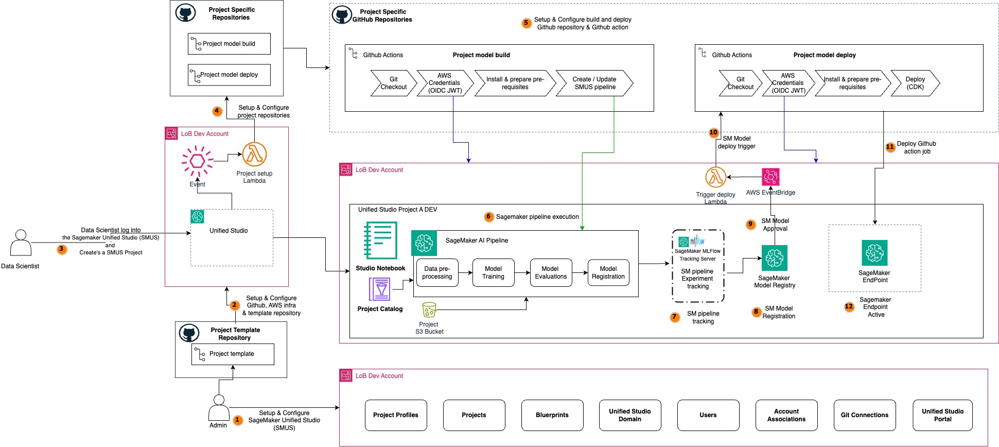

# MLOps SageMaker Unified Studio with GitHub Actions

This repository contains resources required to deploy an MLOps SageMaker Unified Studio (SMUS) Project using GitHub Actions for CI/CD.

## Table of Contents
TBD

## Solution Architecture



## Repository Structure

```
.
├── LICENSE.txt
├── README.md
├── diagrams
├── .github <--- contains the GitHub Action WorkFlow script
│   ├── sm_template_register_service_catalog.yml
├── ml_pipeline  <--- code samples to be used to setup the build of the sagemaker pipeline
├── source_scripts  <--- code samples to be used to setup the build of the sagemaker pipeline
```


### Github connection and setup

1. Setup IAM OpenID Connect (OIDC) identity provider for github [AWS Documentation](https://docs.github.com/en/actions/security-for-github-actions/security-hardening-your-deployments/configuring-openid-connect-in-amazon-web-services). This connection will be used to perform Github CICD using the GitHub Action Pipeline CI/CD (preferred method). Skip this step if you already have a github connection or check with your organiztion if they already have Githib connection enabled.

2. Create an IAM role using the OIDC identity provider. OIDC allows your GitHub Actions workflows to access resources in Amazon Web Services (AWS) without storing the AWS credentials as long-lived GitHub secrets. Follow the [Github Documentation](https://docs.github.com/en/actions/deployment/security-hardening-your-deployments/configuring-openid-connect-in-amazon-web-services) for instructions to configure the IAM trust policy.


    Assign the following additional permissions to this role (_Note: For setup, broad permissions are provided for these services. Later, trim down the permissions to only required ones_):
    ```
        AmazonEC2ContainerRegistryFullAccess
        AmazonS3FullAccess
        AWSServiceCatalogAdminFullAccess
        AWSCloudFormationFullAccess
        IAMFullAccess
        AmazonSageMakerFullAccess
        AmazonSSMFullAccess
    ```

3. Create the following github secrets and variables which will be consumed by the Github action job. These secrets will needed for both model build and model deploy github actions. See [Github documentation](http://docs.github.com/en/actions/security-for-github-actions/security-guides/using-secrets-in-github-actions) for instructions on how to create Github secrets. Note: You can use either github secrets and/or variables based on the content confidentiality.

    `SAGEMAKER_PIPELINE_ROLE_ARN`: The ARN of the IAM role used to execute SageMaker pipelines. Example for illustration only - "arn:aws:iam::<account-id>:role/datazone_usr_role_4gym2gsxqde80g_d6a5f304hfrspc"

    `SAGEMAKER_PROJECT_NAME`: The name of the SageMaker project associated with the pipeline. Example for illustration only - "Build_model_project_finance"

    `SAGEMAKER_PROJECT_ID`: The unique identifier for the SageMaker project. Example for illustration only - "4gym2gsxqde80g"

    `AMAZON_DATAZONE_DOMAIN`: The domain name for Amazon DataZone integration. Example "dzd_d2hu7wi9b2nro0"

    `AMAZON_DATAZONE_SCOPENAME`: The scope name within Amazon DataZone for resource access. Example for illustration only - "dev"

    `SAGEMAKER_DOMAIN_ARN`: The ARN of the SageMaker Studio domain. Example for illustration only - "arn:aws:sagemaker:us-west-2:<account-id>:domain/d-yzd7xzpwhgk9"

    `SAGEMAKER_SPACE_ARN`: The ARN of the SageMaker Studio space for user collaboration. It related to the other secret 'AmazonDataZoneUser'. Example for illustration only - "arn:aws:sagemaker:us-west-2:<account-id>:space/d-yzd7xzpwhgk9/default-b8214310-a081-7072-2dc2-f03e4fb04a0e"

    `SAGEMAKER_USERPROFILE_ARN`: The ARN of the SageMaker Studio user. Refer to the 'AmazonDataZoneUser' and SAGEMAKER_SPACE_ARN to infer the values. Example for illustration only - arn:aws:sagemaker:us-west-2:<account-id>:user-profile/d-yzd7xzpwhgk9/b8214310-a081-7072-2dc2-f03e4fb04a0e

    `AMAZON_DATAZONE_USER`: The unique ID of the SageMaker Studio user. Refer to the SAGEMAKER_SPACE_ARN to infer the values. Example for illustration only - "b8214310-a081-7072-2dc2-f03e4fb04a0e"

    `AMAZON_DATAZONE_PROJECT`: The Amazon DataZone project name linked to the SageMaker resources. "4gym2gsxqde80g"

    `REGION`: The AWS region where SageMaker resources are deployed (e.g., us-east-1).

    `ARTIFACT_BUCKET`: The S3 bucket used to store artifacts like datasets and models. Example for illustration only - "amazon-sagemaker-643732685158-us-west-2-f16345659560"

    `MODEL_PACKAGE_GROUP_NAME`: The name of the model package group for organizing model versions in SageMaker Model Registry. The name should follow the regex Pattern: `^[a-zA-Z0-9](-*[a-zA-Z0-9]){0,255}`.Note: Do not use underscore.Example for illustration only - "github-actions-abalone"

    `PIPELINE_EXECUTION_IAM_ROLE`: The ARN of an IAM role that the GitHub workflow will assume. Example for illustration only - "arn:aws:iam::<account-id>:role/mlops-smus-github-action"
    
    (VARIABLE) `REGION`: The AWS region where SageMaker resources are deployed (e.g., us-east-1).

4. To execute the github actions, after successfully Github connection configurations. 
    * Open the cloned repository on your laptop or SMUS project notebook command line
    * Make change to the paths `ml_pipelines/**` or `source_scripts/**` and commit the changes `git commit -m "<ENTER>"`
    * Push your changes which triggers the github action job execution `git push`


### Local Deployment and testing
Manually deploy SMUS pipeline for local development and testing.

#### Pre-requisites

   * Python3.10 or [Miniconda](https://docs.conda.io/en/latest/miniconda.html)
   * [AWS CLI](https://aws.amazon.com/cli/)
   * [Docker](https://docs.docker.com/desktop/)
   * AWS credentials with sufficient permissions
   * Sagemaker Unified Studio Domain, user profile and login credentials.


#### Project Build

Follow the steps to run the Sagemaker pipeline for model build locally:

1. Clone this repository in your work environment (e.g. your laptop or SMUS project notebook command line)

2. Change the directory to the model build folder : 

    ```
    cd model_build
    ```
3. Install dependencies in a separate Python virtual environment using your preferred Python package manager.

    ```
    $ python3 -m venv .venv
    ```

    After the init process completes and the virtualenv is created, you can use the following
    step to activate your virtualenv.

    ```
    $ source .venv/bin/activate
    ```

    Once the virtualenv is activated, you can install the required dependencies.

    ```
    $ pip install -r requirements.txt
    ```

4. You can now deploy the SMUS pipeline 

```
$ python ./ml_pipelines/run_pipeline.py --module-name training.pipeline     --role-arn <SAGEMAKER_PIPELINE_ROLE_ARN>     --tags '[{"Key":"sagemaker:project-name", "Value":"<SAGEMAKER_PROJECT_NAME>"}, {"Key":"sagemaker:project-id", "Value":"<SAGEMAKER_PROJECT_ID>"}, {"Key":"AmazonDataZoneDomain", "Value":"<AMAZON_DATAZONE_DOMAIN>"}, {"Key":"AmazonDataZoneScopeName", "Value":"<AMAZON_DATAZONE_SCOPENAME>"}, {"Key":"sagemaker:domain-arn", "Value":"<SAGEMAKER_DOMAIN_ARN>"}, {"Key":"sagemaker:space-arn", "Value":"<SAGEMAKER_SPACE_ARN>"}, {"Key":"AmazonDataZoneProject", "Value":"<AMAZON_DATAZONE_PROJECT>"}]'     --kwargs '{"region":"<REGION>","role":"<SAGEMAKER_PIPELINE_ROLE_ARN>","default_bucket":"<ARTIFACT_BUCKET>","pipeline_name":"githubactions-<SAGEMAKER_PROJECT_ID>","model_package_group_name":"git-<MODEL_PACKAGE_GROUP_NAME>","base_job_prefix":"SMUSMLOPS"}'
```

Now you can approve the pipeline and start the deployment process:
1. Go to the AWS Console and navigate to the SageMaker service.
2. In SageMaker Unified Studio Projects, select the project you created.
3. Switch to the "Pipelines" tab and double-click on the pipeline you created.
4. Double-click on the most recent version of the pipeline to view details.

To check the status of the deployment in GitHub:
1. Go to the GitHub repository created by the SMUS project creation. You can verify the Github repository on the SMUS project description page.
2. Go to Actions and select the most recent workflow run.

## Clean-up

## Troubleshooting
- Ignore `Error getting project tags: module 'training.pipeline' has no attribute 'get_pipeline_custom_tags'`
